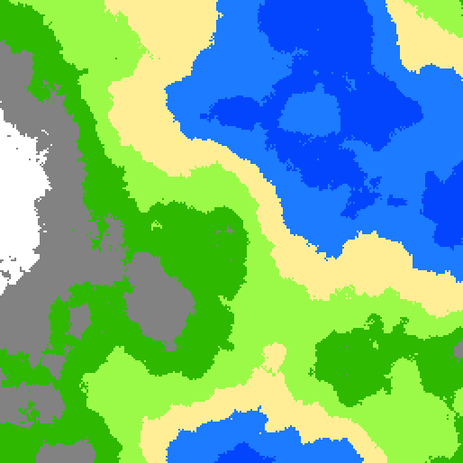
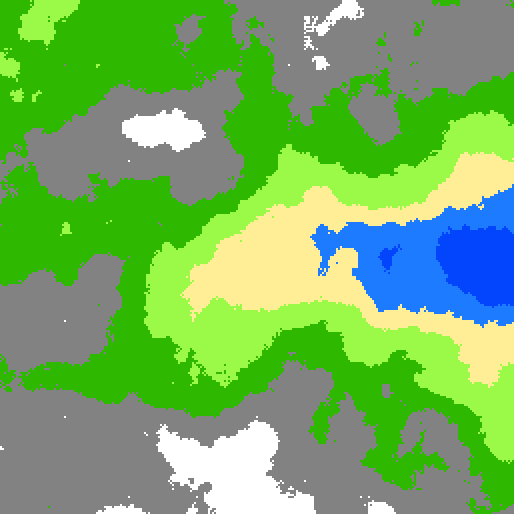
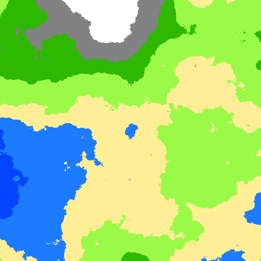

# DiamondSquare Algorithme

I wanted to learn how to generate terrein, but perlin noise is not the easiest algorithm. Fortunately, DiamondSquare existe, so I tried to implement it in JS with p5.js according to the algorithm on wikipedia.

I had to add normalization to make the array resulting usable.

Click [here](https://teddac.github.io/DiamondSquare-heightmap-generator) to have a demo.

